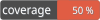

# Aegisora Rule Contract


[](LICENSE)


**Rule Contract** defines the core abstractions for building validation rules in the Aegisora ecosystem.

It provides:
- a minimal, stable, and framework-agnostic contract that allows rules to be shared across packages and projects
- a strict contract for implementing rules
- consistent result handling
- unified exception management

---

## ✨ Features

- 🔹 Lightweight, framework-agnostic design and dependency-free
- 🔹 Stable contract for validation rules
- 🔹 Unified validation result structure
- 🔹 Safe exception handling with execution wrapping
- 🔹 Automatic rule code generation
- 🔹 Supports both simple and complex rules
- 🔹 Designed for extensibility
- 🔹 Compatible with Aegisora ecosystem (`guardian`, `rules`, etc.)

---

## 📦 Installation

```bash
composer require aegisora/rule-contract
```

---

## 🚀 Core Concept

Each rule:
- receives a `Context`
- performs validation logic
- returns a `Result`
- never returns raw booleans
- never throws unstructured exceptions

This ensures predictable and testable validation flow.

---

## 🏗️ Basic Usage

### Creating a Rule

Extend the abstract `Rule` class (simple example):

```php
class UserAgeRule extends Rule
{
    protected function executeValidate(Context $context): Result
    {
        $age = $context->getValue();
        
        if ($age < 18) {
            return $this->getDefaultInvalidResult();
        }
        
        return $this->getDefaultValidResult();
    } 
}
```

### Running a Rule

```php
$rule = new UserAgeRule();
$result = $rule->validate(Context::create(20));
if ($result->isValid()) {
    // valid
}
```

---

## 🏛️ Architecture

### RuleInterface

Defines the contract for all rules:
- `validate(Context $context): Result`

May throw:
- `InvalidRuleContextException`
- `RuleException`
- `RuleExecutionException`

### Rule (Abstract Class)

Base implementation that provides:
- Safe execution layer
  - wraps execution in `try/catch`
  - rethrows domain exceptions as-is
  - wraps unexpected errors into `RuleExecutionException`
- Default helpers
  - `getDefaultValidResult()`
  - `getDefaultInvalidResult()`
- Automatic rule code generation - generates snake_case code from class name:
  - `UserAgeRule` → `user_age_rule`

#### Execution Flow

1. validate() is called
2. executeValidate() runs
3. Result handling:
   - RuleException → rethrown
   - Throwable → wrapped into RuleExecutionException
4. Result is returned

### Context

Encapsulates input data for rule execution.

`Context::create($value);`
- stores `mixed` value
- provides `getValue()` access

Used to decouple rules from application structures.

### Result

Standardized validation result object.

Structure
- `isValid: bool`
- `failedRuleCode: ?string`

Factory methods
- `Result::valid()`
- `Result::invalid('rule_code')`

### Exception Handling

#### RuleException

Base exception for all rule-related errors.

#### InvalidRuleContextException

Thrown when context is invalid for a rule.

#### RuleExecutionException

Thrown when unexpected runtime error occurs during rule execution.

Contains:
- rule class name (getRuleClassName())
- original exception

### Design Principles

This package enforces:
- predictable execution flow
- strict separation of concerns
- consistent validation results
- safe error boundaries
- framework independence
- testable business rules
